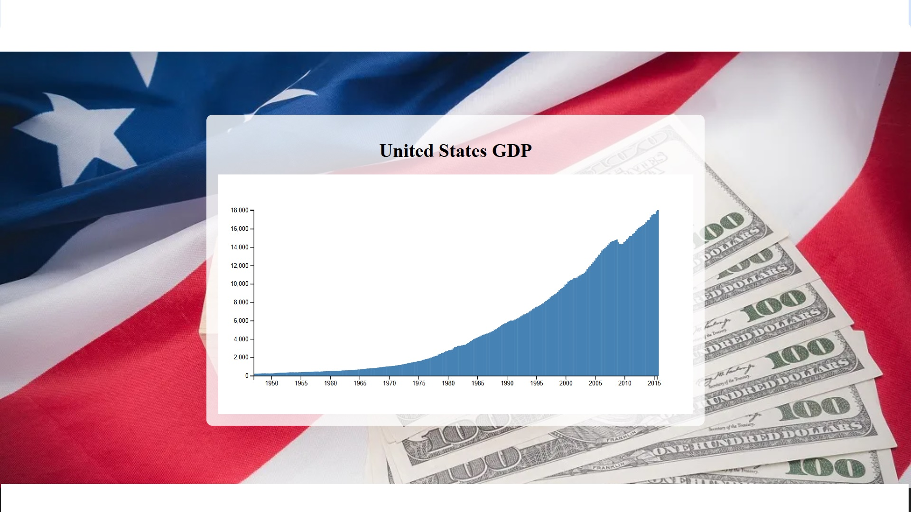

# GDP Bar Chart

This project visualizes the GDP of the United States using a bar chart.

## Live Demo

You can view the live demo [here](https://calm-meringue-21250f.netlify.app/).

## Screenshot



## Description

This project uses D3.js to create an interactive bar chart that displays the GDP of the United States over time. The chart includes tooltips that show the exact GDP value when you hover over a bar.

## Features

- Interactive bar chart
- Tooltips with detailed information
- Responsive design

## Setup

1. Clone the repository:
    ```sh
    git clone https://github.com/AlyAtalla/Bar-Chart.git
    ```
2. Navigate to the project directory:
    ```sh
    cd Bar-Chart
    ```
3. Open `index.html` in your browser to view the chart.

## License

This project is licensed under the MIT License.